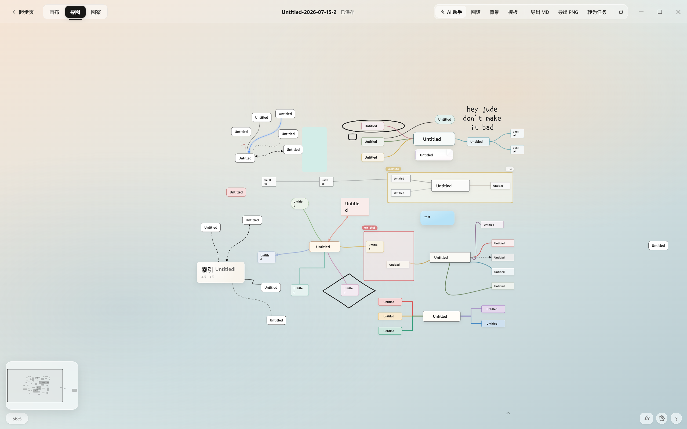
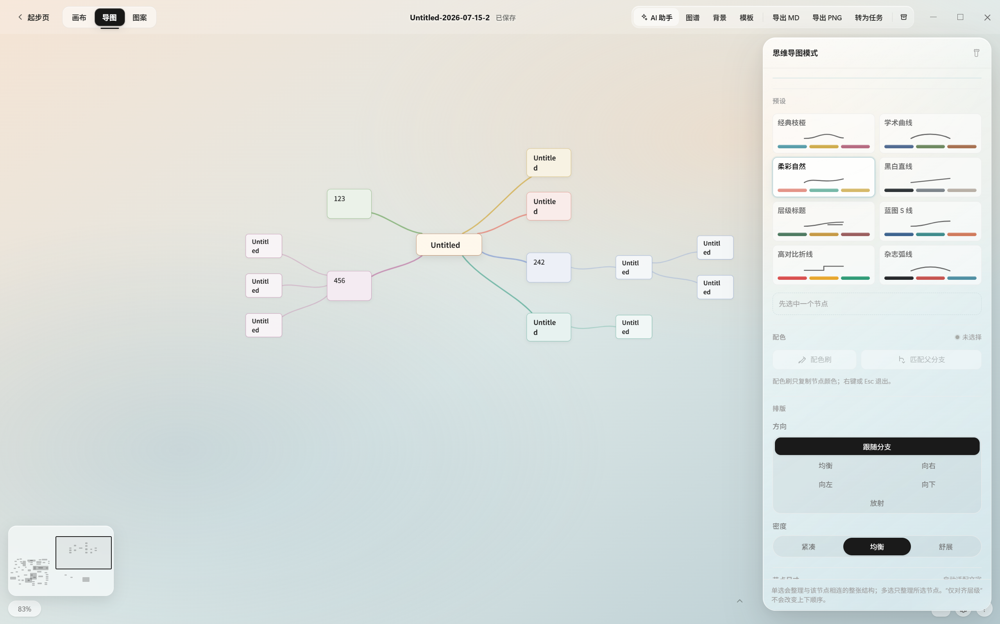
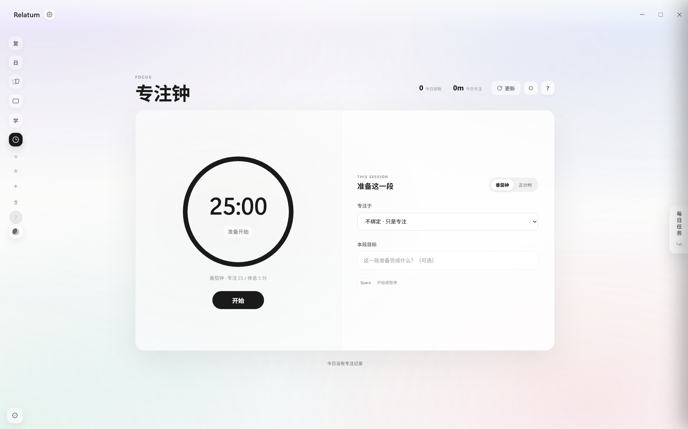
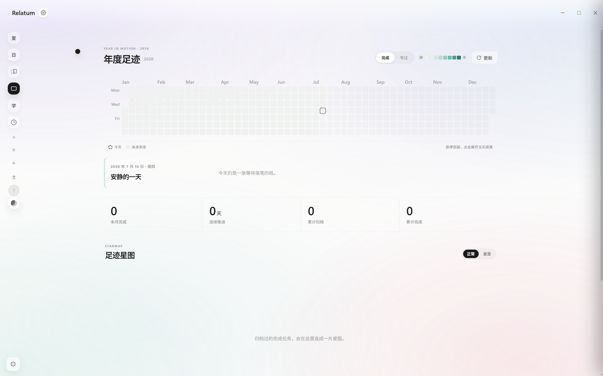
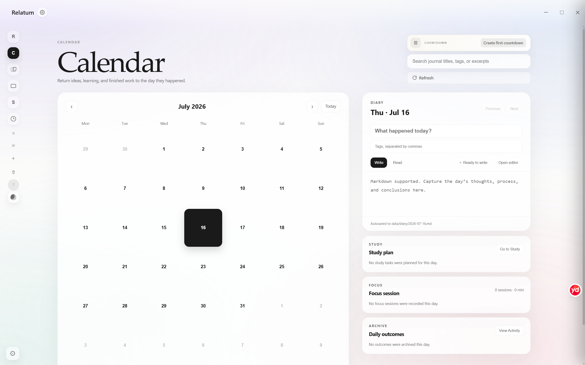
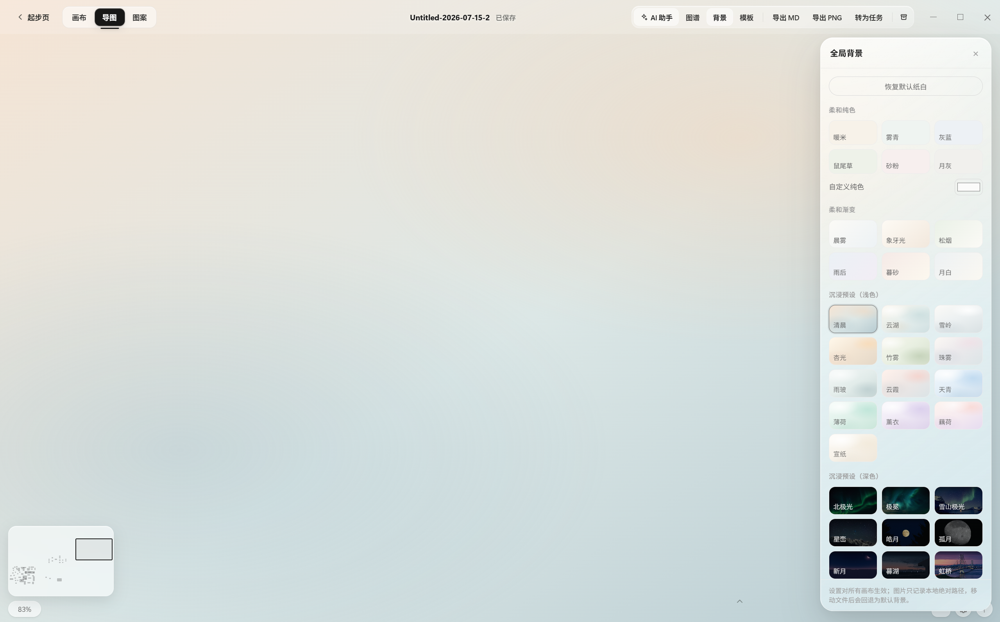

# Relatum

<p align="center">
  <strong>把零散想法放到一张自由画布上，再把它们整理成真正可用的知识。</strong>
</p>

<p align="center">
  开源、本地优先的 Windows 知识画布与学习笔记软件<br>
  适合视觉笔记、个人知识管理（PKM）、课程整理、研究构思与思维导图<br>
  界面语言：简体中文 · English
</p>

<p align="center">
  <a href="README_EN.md">English</a> ·
  <a href="https://github.com/yamibk/Relatum-Opensource/releases/latest/download/Relatum-release.zip"><strong>下载 Windows 版</strong></a> ·
  <a href="https://github.com/yamibk/Relatum-Opensource/releases/latest">查看最新版本</a> ·
  <a href="CONTRIBUTING.md">参与贡献</a>
</p>

<p align="center">
  <a href="https://github.com/yamibk/Relatum-Opensource/releases/latest"></a>
  <a href="LICENSE"></a>
  
  
</p>

<p align="center">
  <a href="https://github.com/yamibk/Relatum-Opensource/releases/latest">
    
  </a>
</p>

## Relatum 是什么？

Relatum 是一款开源、本地优先的自由知识画布和学习工作台。你可以在无限画布上自由创建节点、连接想法、整理课程笔记、阅读资料，也可以把已有内容一键排版成精美的思维导图。

它不要求注册账号，画布、偏好设置和可选的 AI 凭据默认保存在本机。Relatum 适合正在寻找本地笔记软件、无限画布、视觉化知识管理工具，或 Obsidian Canvas 兼容工作流的 Windows 用户。

## 核心能力

### 自由画布，而不是固定大纲

- 自由创建、拖动和连接节点，在同一画布上组织零散想法与复杂结构。
- 自定义节点颜色、大小、形状、圆角、透明度、字重、字号和文字对齐。
- 支持多种连线颜色、线型和路径，也可以加入手写、文字框、色块与装饰图案。
- 基础兼容 Obsidian Canvas 的 `nodes + edges` 结构。

### 一键生成精美思维导图

- 将选中的节点或整张结构一键排版为思维导图。
- 内置多套节点、配色和连线预设，并支持左右、放射、均衡等布局方向。
- 支持分支配色、层级尺寸、间距和线条样式调整。
- 保留自由编辑能力：排版后仍可移动节点、调整样式和重新组织分支。

### 笔记、阅读与资料整理

- 支持 Markdown、公式、Mermaid 图表、代码、图片、PDF 和 Markdown 附件。
- 提供长文阅读、PDF/Markdown 批注、画布搜索、小地图和关系图谱。
- 支持 Markdown 文件夹导入、画布内容导出和 PNG 导出。

### 从记录到行动的学习工作台

- 番茄钟与正计时专注模式，可关联学习任务或每日任务。
- 每日任务、学习看板、日历日记、倒数日、速记墙和间隔复习。
- 活跃统计、年度足迹与任务归档，让长期进度可以被看见。

### 丰富的个性化与智能工具

- 多种柔和渐变、沉浸背景与自定义图片背景。
- 自定义模板和多种预设图案，快速复用常见笔记结构。
- 可选 AI 助手支持对话、整理内容，并在确认后生成到画布。
- AI API 地址、模型和 Key 由用户配置，Key 仅保存在本机。

## 界面预览

<table>
  <tr>
    <td width="50%">
      
      <p align="center">自由节点、连线与丰富样式</p>
    </td>
    <td width="50%">
      
      <p align="center">思维导图预设与一键排版</p>
    </td>
  </tr>
  <tr>
    <td width="50%">
      
      <p align="center">番茄钟与专注记录</p>
    </td>
    <td width="50%">
      
      <p align="center">年度足迹与数据统计</p>
    </td>
  </tr>
</table>

<p align="center">
  
  <br>
  <em>日历日记、倒数日与每日学习记录</em>
</p>



## 快速开始

### 下载 Windows 桌面版

1. [下载最新版 `Relatum-release.zip`](https://github.com/yamibk/Relatum-Opensource/releases/latest/download/Relatum-release.zip)。
2. 将 ZIP 完整解压到一个可写目录。
3. 双击 `Relatum.exe`。

支持 Windows 10/11。目标电脑需要 Microsoft Edge WebView2 Runtime，Windows 10/11 通常已经安装。

> 请不要在旧版本目录中直接覆盖更新。建议先保留旧目录中的 `data/` 和 `canvases/`，确认新版正常后再迁移个人数据。

### 从源码运行

需要 Windows 10/11 与 Python 3.9 或更高版本。源码模式只依赖 Python 标准库：

```powershell
python app.py
```

也可以双击 `打开画布.bat`，或运行：

```powershell
powershell -ExecutionPolicy Bypass -File .\start.ps1
```

首次启动后会在应用目录创建：

- `canvases/`：用户的 `.canvas` 文件及附件。
- `data/`：最近列表、学习记录、日历、窗口状态和 AI 配置等本地数据。

这两个目录已被 `.gitignore` 排除，不会进入源码仓库。完整数据边界请阅读 [隐私说明](docs/PRIVACY.md)。

## 构建 Windows 桌面版

桌面构建支持 Python 3.9–3.12。构建脚本会在临时目录创建环境，并安装固定版本的 PyWebView、PyInstaller 和 Pillow：

```powershell
powershell -ExecutionPolicy Bypass -File .\build-desktop.ps1
```

输出位于项目同级的 `Relatum-release/`。构建脚本不会把 `data/` 或 `canvases/` 打进发布包。

## 项目结构

```text
Relatum/
├─ app.py                    本地 HTTP 服务与数据 API
├─ desktop.py                Windows 桌面外壳
├─ assets/                   HTML、CSS、JavaScript 与运行资源
├─ packaging/                图标、字体和桌面构建辅助工具
├─ build-desktop.ps1         Windows 桌面发布包构建入口
├─ start.ps1                 源码模式启动入口
├─ AI笔记创作指南.md          AI 生成画布时使用的提示指南
└─ AGENTS.md                 架构约束与维护说明
```

## 开发与验证

项目不需要 npm，也没有前端构建步骤。提交修改前至少运行：

```powershell
python -m py_compile app.py desktop.py packaging\make_icon.py packaging\make_font_subset.py

Get-ChildItem assets -Recurse -Filter *.js |
  Where-Object { $_.FullName -notmatch '\\vendor\\' } |
  ForEach-Object { node --check $_.FullName }

powershell -ExecutionPolicy Bypass -File .\scripts\check-public.ps1
```

制作公开 ZIP 或正式发布前，再运行：

```powershell
powershell -ExecutionPolicy Bypass -File .\scripts\check-public.ps1 -Physical
```

## 参与贡献

问题反馈、功能建议、文档改进和代码贡献都欢迎。开始前请阅读 [CONTRIBUTING.md](CONTRIBUTING.md) 和 [AGENTS.md](AGENTS.md)。

## 第三方组件与许可证

仓库内置 Mermaid、MathJax、PDF.js 和若干字体，以便离线运行。许可证和归属见 [THIRD_PARTY_NOTICES.md](THIRD_PARTY_NOTICES.md)。

Relatum 的原创源代码和文档采用 [MIT License](LICENSE)，Copyright © 2026 yamibk。第三方组件、字体与媒体素材继续适用各自的许可范围。
